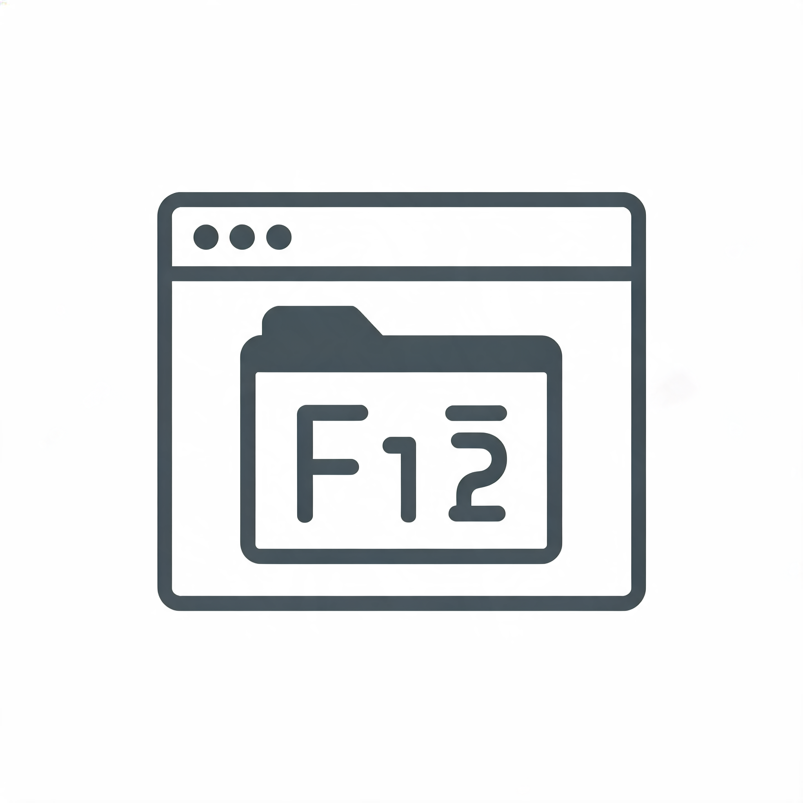

<p align="center">
  
</p>

<h1 align="center">F12 Collector</h1>

<p align="center">
  Browser-Extension für <b>Chrome</b> und <b>Firefox</b>, die auf Knopfdruck alles exportiert,
  was man in den DevTools (F12) einer Website sieht – als ZIP-Archiv, komplett lokal.
</p>

---

## Was wird exportiert?

| Bereich | Chrome | Firefox |
|---|---|---|
| **DOM (Inspektor)** | `DOM.getDocument` (depth -1, pierce) → HTML inkl. offener *und geschlossener* Shadow Roots (als `<template shadowrootmode>`) und iframes | Content Script: DOM inkl. Shadow Roots (`openOrClosedShadowRoot`), alle Frames |
| **Quellcode** | alle Ressourcen (`Page.getResourceContent`) + alle geparsten Scripts (`Debugger.getScriptSource`, inkl. Inline & `eval`) | Ressourcen per `fetch` neu geladen (bevorzugt aus dem Cache), Inline-Scripts/-Styles aus dem DOM |
| **Source Maps** | `sourceMappingURL` (auch `data:`-URLs, Index-Maps) auflösen → Originaldateien in `sources/original/` | gleich |
| **Debugger** | Script-Liste, Source Maps, bei pausierter Seite **Call Stack + Scope-Variablen** | Script-Liste & Source Maps |
| **Netzwerk** | CDP `Network.*` → HAR 1.2 inkl. Bodies, Redirects, Timings, echte (Extra-Info-)Header | `webRequest` + `filterResponseData` → HAR 1.2 inkl. Bodies |
| **Styles** | alle Stylesheets (`CSS.getStyleSheetText`), Computed Styles | `document.styleSheets` (Cross-Origin-Sheets neu geladen), Computed Styles |
| **Webspeicher** | Cookies (inkl. HttpOnly & partitioniert), local/sessionStorage, IndexedDB (alle DBs/Stores), Cache Storage | gleich (inkl. Container-Cookie-Store) |
| **Barrierefreiheit** | echter Accessibility Tree (`Accessibility.getFullAXTree`) | Annäherung: Rollen, ARIA, Zustände, zugängliche Namen |
| **Memory** | Heap-Nutzung, Objekt-Statistik je Konstruktor, Memory-Trace (siehe [Einschränkungen](#einschränkungen)) | nicht möglich |

## Installation & Test

> **Wichtig:** Nicht den Hauptordner des Repos laden (dort gibt es keine `manifest.json` → Fehler
> *„Manifest-Datei fehlt oder ist nicht lesbar“*). Geladen wird immer ein Ordner, der direkt eine
> `manifest.json` enthält.

**Ohne Node.js (empfohlen):** Repo als ZIP herunterladen und entpacken. Die fertig gebauten Extensions liegen in
- `fertige-extension/chrome` – für Chrome, Edge, Brave …
- `fertige-extension/firefox` – für Firefox

**Selbst bauen** (optional, [Node.js](https://nodejs.org) ≥ 20):

```bash
npm install
npm run build          # baut Chrome UND Firefox und aktualisiert fertige-extension/
```

### Chrome (oder Edge, Brave …)

1. `chrome://extensions` öffnen
2. Oben rechts **Entwicklermodus** einschalten
3. **Entpackte Erweiterung laden** → Ordner `fertige-extension/chrome` auswählen (der Ordner, in dem `manifest.json` liegt)
4. Das F12-Collector-Icon an die Symbolleiste anpinnen (Puzzle-Symbol → Pin)

**Testen:**

1. Eine Seite öffnen, z. B. <https://de.wikipedia.org/wiki/Katze>
2. **Popup:** auf das Icon klicken → **„Snapshot erstellen“** → das ZIP landet im Download-Ordner
3. **DevTools:** F12 drücken → Tab **„F12 Collector“** (ggf. hinter `»`) → dieselben Optionen
4. **„Aufzeichnen & neu laden“** klicken: die Seite wird neu geladen, alle Requests inkl. Bodies landen in `network.har`
5. `network.har` prüfen: DevTools → Tab *Netzwerk* → Symbol „HAR importieren“ (Pfeil nach oben) → Datei wählen
6. Debugger-Zustand testen: in DevTools unter *Quellen* einen Breakpoint setzen, Seite anhalten lassen, dann im Tab *F12 Collector* „Snapshot erstellen“ → `debugger/paused-state.json`

> Während des Exports zeigt Chrome oben den Hinweis *„F12 Collector hat begonnen, diesen Browser zu debuggen“*. Das ist normal (chrome.debugger) und verschwindet danach automatisch – der Debugger wird immer wieder getrennt, auch im Fehlerfall.

### Firefox (ab Version 140)

1. `about:debugging#/runtime/this-firefox` öffnen
2. **Temporäres Add-on laden …** → Datei `fertige-extension/firefox/manifest.json` auswählen
3. **Wichtig:** Firefox erteilt bei Manifest V3 den Zugriff auf Websites nicht automatisch.
   Popup öffnen → roten Button **„Zugriff auf alle Websites erlauben“** klicken
   (alternativ `about:addons` → F12 Collector → *Berechtigungen* → „Auf Ihre Daten für alle Websites zugreifen“)
4. Testen wie bei Chrome (Popup oder F12 → Tab „F12 Collector“)

Temporäre Add-ons verschwinden beim Beenden von Firefox. Für eine dauerhafte Installation: `npm run zip` und die ZIP-Datei aus `.output/` bei [addons.mozilla.org](https://addons.mozilla.org/developers/) (auch „nicht gelistet“) signieren lassen.

### Entwicklung

```bash
npm run dev            # Chrome mit Hot-Reload (öffnet einen Test-Browser)
npm run dev:firefox    # Firefox mit Hot-Reload
npm run compile        # TypeScript prüfen
npm run zip            # ZIPs für die Stores bauen
```

Die Icons (16/32/48/128 px) werden per `npm run icons` automatisch aus `logo.png` erzeugt (läuft vor `dev`/`build` mit, `logo.png` selbst wird nie verändert).

## Bedienung

- **Bereiche**: Checkbox pro Bereich; nicht verfügbare Bereiche sind ausgegraut und markiert („nicht verfügbar“ / „eingeschränkt“).
- **Snapshot erstellen**: exportiert den aktuellen Zustand, ohne die Seite neu zu laden.
- **Aufzeichnen & neu laden**: aktiviert zuerst Netzwerk-Mitschnitt (und in Chrome die Script-Erfassung), lädt die Seite ohne Cache neu, wartet bis das Netzwerk ruhig ist (Standard 2 s ohne Request, max. 30 s) und macht dann den Snapshot.
- **Fortschritt**: jeder Schritt mit Status (läuft / fertig / Hinweis / Fehler), danach Dateiname, fehlende Bereiche und alle Hinweise.
- **Einstellungen** (werden gespeichert, ebenso die gewählten Bereiche): max. Dateigröße, Response-Bodies ja/nein, Computed Styles (nur sichtbare / alle / keine, Limit, nur Abweichungen vom Standard), Ruhezeit & Maximaldauer der Aufzeichnung, IndexedDB-Limit, Source-Map-Limit.

## Export-Format

```
f12-collector_<domain>_<zeitstempel>/
├── dom/
│   ├── index.html              Hauptdokument (Shadow DOM als <template shadowrootmode>)
│   ├── frames/                 iframes (+ index.json)
│   └── shadow-roots.json
├── sources/
│   ├── <domain>/<pfad>         alle Ressourcen, nach Domain/Pfad sortiert
│   ├── _inline/                Inline-Scripts/-Styles je Seite
│   ├── _dynamic/               per eval erzeugte Scripts (Chrome)
│   ├── sourcemaps/             .map-Dateien (+ index.json)
│   ├── original/               aus Source Maps rekonstruierte Originaldateien
│   └── index.json
├── debugger/                   scripts.json, sourcemaps.json, paused-state.json
├── network.har                 HAR 1.2 – in Chrome/Firefox-DevTools importierbar
├── styles/
│   ├── stylesheets/            alle Stylesheets (+ index.json)
│   └── computed-styles.json
├── storage/
│   ├── cookies.json, local.json, session.json
│   ├── indexeddb/<origin>/<db>.json
│   └── cache/<origin>/<cache>/index.json (+ files/)
├── accessibility.json
├── memory/                     (nur Chrome) heap-usage.json, object-counts.json, memory-infra.trace.json
└── manifest.json               URL, Browser, Zeitpunkt, Version, aktive Bereiche, Status je Bereich,
                                Warnungen, übersprungene Dateien, was fehlt
```

## Sicherheit & Datenschutz

- **Keine Daten verlassen den Rechner.** Kein Upload, keine Telemetrie, keine externen Server. Das ZIP wird lokal erzeugt und über die Download-API gespeichert.
- **Redaction ist standardmäßig AN** und ersetzt durch `[REDACTED]`:
  - alle Cookie-Werte (`storage/cookies.json`, Cookies im HAR)
  - Header `Authorization`, `Proxy-Authorization`, `Cookie`, `Set-Cookie`, `X-CSRF-Token`, `X-XSRF-Token`, `X-API-Key`, `X-Auth-Token`
  - Storage-Einträge (local/sessionStorage, IndexedDB), deren Key nach Token aussieht (`token`, `auth`, `session`, `secret`, `password`, `api_key`, `jwt`, `csrf` …)
  - JWT-Muster (`eyJ….….…`) und `Bearer …` in beliebigen Werten (Storage, Header, POST-Bodies)
  - Scope-Variablen mit solchen Namen im Debugger-Export
- Abschaltbar über die Checkbox „Sensible Daten schwärzen“ – dann erscheint ein deutlicher Warnhinweis, und `manifest.json` vermerkt, dass der Export ungeschwärzt ist.
- Nicht geschwärzt werden: Response-Bodies und Quellcode (können selbst Tokens enthalten), URLs/Query-Parameter.

## Robustheit

- Jeder Collector läuft **isoliert** mit eigenem Timeout: ein Fehler landet als Warnung in `manifest.json`, der Rest wird trotzdem exportiert.
- Jeder CDP-Befehl hat ein Timeout; der **Debugger wird immer getrennt** (`finally`), auch bei Fehlern.
- **Pausierte Seite** (Breakpoint): wird erkannt; Schritte, die dann nicht laufen können (Content Scripts, CSS-Domain), werden mit Hinweis übersprungen statt zu hängen.
- **Größenlimit** pro Datei/Body (Standard 20 MB, einstellbar). Übersprungene Dateien stehen in `manifest.json → skippedFiles`.
- Tabs, die schon vor der Installation offen waren, bekommen das Content Script automatisch nachinjiziert.

## Einschränkungen

### Allgemein
- Browser-interne Seiten (`chrome://`, `about:`, Web Store / addons.mozilla.org) sind für Extensions gesperrt.
- **Snapshot ohne Aufzeichnung**: Browser geben vergangene Requests nicht heraus. Aus dem **Popup** enthält `network.har` dann nur Resource-Timing-Daten (URLs, Zeiten, Größen – keine Header/Bodies). Aus dem **DevTools-Panel** wird `devtools.network.getHAR()` übernommen (Requests seit Öffnen der DevTools) plus die Bodies, die das Panel seit dem Öffnen gepuffert hat. Vollständig: **„Aufzeichnen & neu laden“**.
- Computed Styles werden bewusst begrenzt (Standard: nur sichtbare Elemente, max. 300 pro Frame, nur Abweichungen vom Browser-Standard). Für den Standardvergleich wird kurzzeitig ein unsichtbares leeres iframe in die Seite eingefügt.

### Chrome
- **Kein echter Heap Snapshot (`.heapsnapshot`)**: Chrome erlaubt Extensions über `chrome.debugger` nur eine feste Liste von DevTools-Protocol-Domains. `HeapProfiler` und `Memory` gehören nicht dazu (Antwort: *„'HeapProfiler.enable' wasn't found“*; auch der Umweg über `Target.attachToTarget` ist gesperrt und `--enable-unsafe-extension-debugging` hebt das nicht auf – getestet mit Chromium 141). Der Bereich *Memory* exportiert deshalb, was über erlaubte Domains geht:
  - `memory/heap-usage.json` – belegter/gesamter JS-Heap
  - `memory/object-counts.json` – Anzahl lebender Objekte je Konstruktor (`Runtime.queryObjects`, entspricht grob der Summary-Ansicht eines Heap Snapshots)
  - `memory/memory-infra.trace.json` – detaillierter Memory-Dump via Tracing, lokal in <https://ui.perfetto.dev> öffnbar
  - Einen echten Heap Snapshot erstellt man manuell: DevTools → *Memory* → *Take snapshot* → Rechtsklick → *Save…*
- Cross-Origin-iframes in eigenen Prozessen (Site Isolation) sind im CDP-DOM nicht enthalten; sie kommen aus dem Content Script (`dom/frames/`, Quelle in `index.json`).
- Ist die Seite im Debugger angehalten, fehlen Webspeicher-Inhalte (außer Cookies), Styles und Frame-Inhalte, weil keine Scripts in der Seite laufen können.

### Firefox
- **Memory**: nicht möglich – Firefox bietet Extensions keinen Zugriff auf Heap-Daten.
- **Debugger**: nur Script-Liste und Source Maps. Call Stack, Scope-Variablen und Breakpoints sind für Extensions nicht zugänglich.
- **Barrierefreiheit**: nur Annäherung (Rollen explizit/implizit, ARIA-Attribute, Zustände, vereinfachte Namensberechnung). Firefox hat keine Accessibility-API für Extensions.
- **Quellcode**: wird per `fetch` neu geladen (Inhalt kann abweichen, falls der Server inzwischen anderes liefert); per `eval`/`new Function` erzeugter Code fehlt. API-Aufrufe (fetch/XHR) werden aus Sicherheitsgründen *nicht* erneut ausgeführt.
- **Netzwerk**: Timings vereinfacht (kein DNS/Connect/SSL), Requests von Service Workern fehlen, Medien-Streams/WebSockets ohne Body.
- **Shadow DOM**: geschlossene Shadow Roots über `openOrClosedShadowRoot`, adoptierte Stylesheets ohne Quell-URL.
- Host-Berechtigung muss bei Manifest V3 einmalig bestätigt werden (siehe Installation).

## Getroffene Entscheidungen

- **UI in Vanilla TypeScript** (kein Framework) – klein, schnell, eine gemeinsame Oberfläche (`lib/ui/app.ts`) für Popup und DevTools-Panel.
- **Icons per Script mit `sharp`** (`scripts/generate-icons.mjs`) statt `@wxt-dev/auto-icons`, damit zusätzlich ein 256-px-Logo für die UI entsteht; die generierten PNGs sind eingecheckt.
- **Zusätzliche Berechtigungen** gegenüber der Vorgabe:
  - `scripting` – Content Script in allen Frames aufrufen (mit Frame-ID) und in bereits offene Tabs nachladen
  - `offscreen` (nur Chrome) – der Service Worker kann keine Blob-URLs erzeugen; ein Offscreen-Dokument stellt die ZIP-Datei für den Download bereit (Fallback: `data:`-URL)
  - `webRequestBlocking` (nur Firefox) – nötig für `filterResponseData` (Response-Bodies)
- **Zusätzliche Ordner im Export**: `debugger/` (Script-Liste, Source Maps, Pausenzustand) und `memory/` (statt `memory.heapsnapshot`, siehe oben).
- **Größenlimit** gilt für Ressourcen (`sources/`, `styles/stylesheets/`, `storage/cache/`, `dom/frames/`) und Response-Bodies im HAR – nicht für Kern-Dateien wie `dom/index.html`, `network.har` oder `accessibility.json`.
- **Chrome-Fallbacks**: kann `chrome.debugger` nicht verbunden werden (z. B. weil eine andere Extension debuggt), nutzt Chrome automatisch die Content-Script-Varianten (dieselben wie in Firefox) und vermerkt das.
- **Build-Hinweis Firefox**: `addons-linter` meldet 0 Fehler; die Warnung `DANGEROUS_EVAL` stammt aus dem `setImmediate`-Polyfill in JSZip und wird von F12 Collector nie ausgelöst.

## Projektstruktur

```
entrypoints/        background.ts, content.ts, popup/, devtools/, devtools-panel/, offscreen/
collectors/
  chrome/           CDP-basierte Collector (dom, sources, debugger, network-recorder, styles, accessibility, memory, cdp.ts)
  firefox/          Content-Script-/fetch-basierte Collector (auch Fallback für Chrome)
  shared/           für beide gleich: storage, network (HAR), sourcemaps
lib/                job.ts (Ablauf), export.ts (ZIP + Download), recording.ts, har.ts, redact.ts, settings.ts, content/ (Content-Script-Teile), ui/
scripts/            generate-icons.mjs
```

Jeder Collector erfüllt dieselbe Schnittstelle: `(ctx) => Promise<{ files: { pfad: inhalt }, warnings: string[] }>`.
