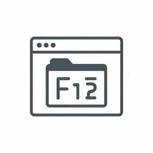

<p align="center">
  
</p>

<h1 align="center">F12 Collector</h1>

<p align="center">
  A browser extension for <b>Chrome</b> and <b>Firefox</b> that exports everything you see in a
  website's DevTools (F12) with one click – as a ZIP archive, entirely on your machine.
</p>

---

> ⚠️ **Authorised use only.** F12 Collector and its checker are **passive** tools: they only
> collect and analyse what your browser already received, and they perform **no active scanning**
> and no requests to third-party sites. Use them on **your own sites** or targets you are
> **explicitly authorised** to test (for example an in-scope bug-bounty program).

## What gets exported?

| Area | Chrome | Firefox |
|---|---|---|
| **DOM (Inspector)** | `DOM.getDocument` (depth -1, pierce) → HTML incl. open *and closed* shadow roots (as `<template shadowrootmode>`) and iframes | Content script: DOM incl. shadow roots (`openOrClosedShadowRoot`), all frames |
| **Sources** | all resources (`Page.getResourceContent`) + all parsed scripts (`Debugger.getScriptSource`, incl. inline & `eval`) | resources re-downloaded via `fetch` (preferably from the cache), inline scripts/styles from the DOM |
| **Source maps** | resolves `sourceMappingURL` (incl. `data:` URLs, index maps) → original files in `sources/original/` | same |
| **Debugger** | script list, source maps and, if the page is paused, the **call stack + scope variables** | script list & source maps |
| **Network** | CDP `Network.*` → HAR 1.2 incl. bodies, redirects, timings, real (extra-info) headers | `webRequest` + `filterResponseData` → HAR 1.2 incl. bodies |
| **Styles** | all stylesheets (`CSS.getStyleSheetText`), computed styles | `document.styleSheets` (cross-origin sheets re-downloaded), computed styles |
| **Storage** | cookies (incl. HttpOnly & partitioned), local/sessionStorage, IndexedDB (all DBs/stores), Cache Storage | same (incl. container cookie stores) |
| **Accessibility** | the real accessibility tree (`Accessibility.getFullAXTree`) | approximation: roles, ARIA, states, accessible names |
| **Memory** | heap usage, object counts per constructor, memory trace (see [Limitations](#limitations)) | not possible |
| **Console** | page `console.*` + errors (in-page probe) and browser-level CDP `Log`/`Runtime` messages | page `console.*` + errors (in-page probe) |
| **window globals** | page-added `window` properties, diffed against a document_start baseline (previews, redacted) | same |
| **Event listeners** | `DOMDebugger.getEventListeners` for window/document/elements | not possible |
| **Performance** | Web Vitals (LCP/CLS/INP/FCP/TTFB) + long tasks, navigation & resource timing | same (Web Vitals via `PerformanceObserver`) |
| **Coverage** | CDP precise **JS** coverage + **CSS** rule usage (best with Record & reload) | not possible |
| **Page capture** | full-page **PNG** (`Page.captureScreenshot`) + **MHTML** (`Page.captureSnapshot`) | visible-area PNG (`tabs.captureVisibleTab`), no MHTML |
| **Assets** | images/fonts/media the page loaded, saved by type | same |
| **Application** | service workers (+ code), web app manifest, storage quota; CDP SW details | service workers, manifest, storage quota (no CDP details) |
| **WebSockets/EventSource** | connections + frames (in-page probe wrappers) | same |
| **Security (headers/TLS)** | security-header checks + **TLS certificate** (record mode) | header checks only, no TLS certificate |
| **Tech stack** | framework/CMS/analytics/CDN detection (headers, scripts, HTML, globals) | same |
| **Third parties** | foreign domains, request types, cookie-setting, known-tracker flag | same |
| **Meta files** | passive same-origin robots.txt, sitemap.xml, `.well-known/*`, security.txt … | same |
| **Endpoint & secret scan** | API paths + secret patterns in JS → `security/findings.json` (values redacted) | same |

## Installation & testing

> **Important:** do not load the repository's root folder – it has no `manifest.json`, and Chrome
> reports *"Manifest file is missing or unreadable"*. Always load a folder that directly contains a
> `manifest.json`.

**Without Node.js (recommended):** download the repository as a ZIP and unpack it. The ready-to-use
extensions are in
- `prebuilt/chrome` – for Chrome, Edge, Brave …
- `prebuilt/firefox` – for Firefox

**Build it yourself** (optional, [Node.js](https://nodejs.org) ≥ 20):

```bash
npm install
npm run build          # builds Chrome AND Firefox and updates prebuilt/
```

### Chrome (or Edge, Brave …)

1. Open `chrome://extensions`
2. Turn on **Developer mode** (top right)
3. **Load unpacked** → select the `prebuilt/chrome` folder (the folder that contains `manifest.json`)
4. Pin the F12 Collector icon to the toolbar (puzzle icon → pin)

**Testing:**

1. Open a page, e.g. <https://en.wikipedia.org/wiki/Cat>
2. **Popup:** click the icon → **"Take snapshot"** → the ZIP is saved to your downloads folder
3. **DevTools:** press F12 → **"F12 Collector"** tab (possibly behind `»`) → same options
4. Click **"Record & reload"**: the page reloads and all requests, including bodies, end up in `network.har`
5. Check `network.har`: DevTools → *Network* tab → "Import HAR file" (up-arrow icon) → select the file
6. Test the debugger state: set a breakpoint in DevTools under *Sources*, let the page pause, then click "Take snapshot" in the *F12 Collector* tab → `debugger/paused-state.json`

> During an export Chrome shows the banner *"F12 Collector started debugging this browser"*. This is
> expected (chrome.debugger) and disappears automatically afterwards – the debugger is always
> detached, even when something fails.

### Firefox (version 140 or later)

1. Open `about:debugging#/runtime/this-firefox`
2. **Load Temporary Add-on …** → select `prebuilt/firefox/manifest.json`
3. **Important:** with Manifest V3, Firefox does not grant access to websites automatically.
   Open the popup → click the red **"Allow access to all websites"** button
   (or `about:addons` → F12 Collector → *Permissions* → "Access your data for all websites")
4. Test as in Chrome (popup, or F12 → "F12 Collector" tab)

Temporary add-ons disappear when Firefox quits. For a permanent installation, run `npm run zip` and
have the ZIP from `.output/` signed on [addons.mozilla.org](https://addons.mozilla.org/developers/)
(an "unlisted" add-on is fine).

### Development

```bash
npm run dev            # Chrome with hot reload (opens a test browser)
npm run dev:firefox    # Firefox with hot reload
npm run compile        # type-check with TypeScript
npm run zip            # build ZIPs for the stores
```

The icons (16/32/48/128 px) and the UI logo are generated automatically from
`f12collector-logo.png` by `npm run icons` (runs as part of `dev`/`build`). The logo is trimmed to
its content and placed on a rounded black tile so it stays legible at 16 px; the source file itself
is never modified.

## Usage

- **Areas**: one checkbox per area, grouped into **Core / Runtime / Capture / App & Network / Security**; unavailable areas are greyed out and marked ("unavailable" / "limited"). Console, WebSockets, Performance, window-globals and Coverage are most complete with **Record & reload**.
- **Take snapshot**: exports the current state without reloading the page.
- **Record & reload**: first starts network recording (and script capture in Chrome), reloads the page without cache, waits until the network is idle (default: 2 s without requests, max. 30 s) and then takes the snapshot.
- **Progress**: every step with its status (running / done / note / error), followed by the file name, missing areas and all notes.
- **Settings** (saved, as are the selected areas): max. file size, response bodies yes/no, computed styles (visible only / all / none, limit, only values that differ from defaults), idle time & max. recording duration, IndexedDB limit, source map limit.

## Export format

```
f12-collector_<domain>_<timestamp>/
├── dom/
│   ├── index.html              main document (shadow DOM as <template shadowrootmode>)
│   ├── frames/                 iframes (+ index.json)
│   └── shadow-roots.json
├── sources/
│   ├── <domain>/<path>         all resources, sorted by domain/path
│   ├── _inline/                inline scripts/styles per page
│   ├── _dynamic/               scripts created via eval (Chrome)
│   ├── sourcemaps/             .map files (+ index.json)
│   ├── original/               original files reconstructed from source maps
│   └── index.json
├── debugger/                   scripts.json, sourcemaps.json, paused-state.json
├── network.har                 HAR 1.2 – importable in Chrome/Firefox DevTools
├── styles/
│   ├── stylesheets/            all stylesheets (+ index.json)
│   └── computed-styles.json
├── storage/
│   ├── cookies.json, local.json, session.json
│   ├── indexeddb/<origin>/<db>.json
│   └── cache/<origin>/<cache>/index.json (+ files/)
├── accessibility.json
├── memory/                     (Chrome only) heap-usage.json, object-counts.json, memory-infra.trace.json, README.txt
├── console/                    console.json (page console + errors + CDP log)
├── performance/                performance.json (Web Vitals, timings)
├── coverage/                   (Chrome) js-coverage.json, css-coverage.json, summary.json
├── snapshot/                   page.png + page.mhtml (Chrome) / viewport.png (Firefox)
├── assets/                     images/, fonts/, video/, audio/ (+ index.json)
├── application/                service-workers*, manifest*, storage-quota.json
├── network/                    websockets.json
├── meta/                       robots.txt, sitemap.xml, .well-known files (+ index.json)
├── dom/event-listeners.json    (Chrome)
├── sources/window-globals.json
├── security/                   headers.json, tls.json, techstack.json, third-parties.json, findings.json
└── manifest.json               URL, browser, time, version, active areas, status per area,
                                warnings, skipped files, what is missing
```

## Security & privacy

- **No data leaves your machine.** No uploads, no telemetry, no external servers. The ZIP is created locally and saved via the downloads API.
- **Redaction is ON by default** and replaces the following with `[REDACTED]`:
  - all cookie values (`storage/cookies.json`, cookies in the HAR)
  - the headers `Authorization`, `Proxy-Authorization`, `Cookie`, `Set-Cookie`, `X-CSRF-Token`, `X-XSRF-Token`, `X-API-Key`, `X-Auth-Token`
  - storage entries (local/sessionStorage, IndexedDB) whose key looks like a token (`token`, `auth`, `session`, `secret`, `password`, `api_key`, `jwt`, `csrf` …)
  - JWT patterns (`eyJ….….…`) and `Bearer …` in any value (storage, headers, POST bodies)
  - scope variables with such names in the debugger export
  - console arguments, page errors and WebSocket/EventSource message text
  - `window` global previews, tech-stack evidence, third-party sample URLs and scanned endpoints
- It can be turned off with the "Redact sensitive data" checkbox – a clear warning is shown, and `manifest.json` records that the export is unredacted.
- Not redacted: response bodies and source code (which may contain tokens themselves), URLs/query parameters.

## Robustness

- Every collector runs **in isolation** with its own timeout: an error becomes a warning in `manifest.json`, and everything else is still exported.
- Every CDP command has a timeout; the **debugger is always detached** (`finally`), even on errors.
- **Paused page** (breakpoint): detected automatically; steps that cannot run in that state (content scripts, CSS domain) are skipped with a note instead of hanging.
- **Size limit** per file/body (default 20 MB, configurable). Skipped files are listed in `manifest.json → skippedFiles`.
- Tabs that were already open before installation get the content script injected automatically.

## Limitations

### General
- Internal browser pages (`chrome://`, `about:`, Web Store / addons.mozilla.org) are off-limits for extensions.
- **Snapshot without recording**: browsers do not hand out past requests. From the **popup**, `network.har` then only contains Resource Timing data (URLs, timings, sizes – no headers/bodies). From the **DevTools panel**, `devtools.network.getHAR()` is used (requests since DevTools was opened) plus the bodies the panel has buffered since it was opened. For complete data use **"Record & reload"**.
- Computed styles are intentionally limited (default: visible elements only, max. 300 per frame, only values that differ from browser defaults). For the default comparison an invisible empty iframe is briefly inserted into the page.

### Chrome
- **No real heap snapshot (`.heapsnapshot`)**: Chrome only allows extensions a fixed list of DevTools Protocol domains via `chrome.debugger`. `HeapProfiler` and `Memory` are not among them (response: *"'HeapProfiler.enable' wasn't found"*; the detour via `Target.attachToTarget` is blocked too, and `--enable-unsafe-extension-debugging` does not lift it – tested with Chromium 141). The *Memory* area therefore exports what the allowed domains provide:
  - `memory/heap-usage.json` – used/total JS heap
  - `memory/object-counts.json` – number of live objects per constructor (`Runtime.queryObjects`, roughly the Summary view of a heap snapshot)
  - `memory/memory-infra.trace.json` – detailed memory dump via Tracing, can be opened locally in <https://ui.perfetto.dev>
  - To take a real heap snapshot manually: DevTools → *Memory* → *Take snapshot* → right-click → *Save…*
- Cross-origin iframes in separate processes (site isolation) are not part of the CDP DOM; they come from the content script (`dom/frames/`, source noted in `index.json`).
- If the page is paused in the debugger, storage contents (except cookies), styles and frame contents are missing, because no scripts can run in the page.

### Firefox
- **Memory**: not possible – Firefox gives extensions no access to heap data.
- **Debugger**: script list and source maps only. Call stack, scope variables and breakpoints are not accessible to extensions.
- **Accessibility**: approximation only (explicit/implicit roles, ARIA attributes, states, simplified name computation). Firefox has no accessibility API for extensions.
- **Sources**: re-downloaded via `fetch` (content may differ if the server now returns something else); code created via `eval`/`new Function` is missing. API calls (fetch/XHR) are deliberately *not* repeated.
- **Network**: simplified timings (no DNS/connect/SSL), service worker requests are missing, media streams/WebSockets have no body.
- **Shadow DOM**: closed shadow roots via `openOrClosedShadowRoot`, adopted stylesheets without a source URL.
- With Manifest V3 the host permission has to be granted once (see installation).
- **Event listeners** and **Coverage**: unavailable (no CDP equivalent for extensions).
- **Page capture**: only the visible viewport (`tabs.captureVisibleTab`), no full-page screenshot and no MHTML.
- **Security**: response-header checks work, but there is no TLS certificate (needs Chrome CDP).
- **Application**: service-worker registrations, manifest and storage quota work; the extra CDP service-worker details do not.
- **Console / WebSockets / Performance / window globals** use an in-page probe injected at
  `document_start`; they only see events from a page that loaded with the extension installed –
  use **Record & reload** for complete data. (Same caveat applies on Chrome.)

## Design decisions

- **MAIN-world probe** (`entrypoints/probe.content.ts`): a tiny always-on content script injected
  at `document_start` in every frame buffers what can only be seen from inside the page and from
  the start – `console.*`, errors, WebSocket/EventSource frames, Web Vitals and the baseline of
  `window` keys. The background reads the buffers on demand via `scripting.executeScript` (world
  MAIN). Nothing is sent anywhere. This powers Console, WebSockets, Performance and window-globals
  in both browsers.
- **UI in vanilla TypeScript** (no framework) – small and fast, one shared UI (`lib/ui/app.ts`) for the popup and the DevTools panel, with a dark blue theme matching the logo (accent `#1274FF`).
- **Icons via a `sharp` script** (`scripts/generate-icons.mjs`) instead of `@wxt-dev/auto-icons`, so it can also crop the logo, round the corners and produce a 256 px logo for the UI; the generated PNGs are committed.
- **Additional permissions** beyond the original spec:
  - `scripting` – call the content script in all frames (with frame IDs) and inject it into tabs that were already open
  - `offscreen` (Chrome only) – the service worker cannot create blob URLs; an offscreen document provides the ZIP for the download (fallback: `data:` URL)
  - `webRequestBlocking` (Firefox only) – required for `filterResponseData` (response bodies)
- **Additional folders in the export**: `debugger/` (script list, source maps, paused state) and `memory/` (instead of `memory.heapsnapshot`, see above).
- The **size limit** applies to resources (`sources/`, `styles/stylesheets/`, `storage/cache/`, `dom/frames/`) and response bodies in the HAR – not to core files like `dom/index.html`, `network.har` or `accessibility.json`.
- **Chrome fallbacks**: if `chrome.debugger` cannot be attached (e.g. because another extension is debugging the tab), Chrome automatically uses the content-script variants (the same as in Firefox) and notes this.
- **Firefox build note**: `addons-linter` reports 0 errors; the `DANGEROUS_EVAL` warning comes from the `setImmediate` polyfill inside JSZip and is never triggered by F12 Collector.

## Checker (offline security analysis)

The `checker/` folder contains a **standalone, offline** tool that reads an F12 Collector export
and passively looks for common weaknesses. It makes **no network requests** and never touches a
live site – it only reads the exported files.

**Windows:** double-click `checker/check.bat`, drag the exported ZIP onto the window (or paste its
path), press Enter – `report.html` opens automatically.

**Any OS:**

```bash
python checker/check.py path/to/f12-collector_example.com_….zip     # or an unpacked folder
```

It checks (only for areas present in the export, otherwise “not checked”):

- **Security headers** – CSP, HSTS, X-Frame-Options, X-Content-Type-Options, Referrer-Policy,
  Permissions-Policy, COOP, and CORS misconfiguration (`ACAO: *` + credentials)
- **Cookies** – missing `Secure` / `HttpOnly` / `SameSite`
- **Secrets in JS** – from `security/findings.json` (values stay masked)
- **Mixed content** – `http://` sub-resources on an HTTPS page
- **Outdated libraries** – versions from `security/techstack.json` vs the local, offline
  `checker/data/cve-list.json` (a small, **manually maintained** list – not an authoritative feed)
- **Telltale comments / internal URLs** – `TODO/FIXME/…`, credentials in comments, internal hosts
- **Meta files** – sensitive `Disallow:` entries, exposed `.well-known` files

Output: `report.html` (with a red/yellow/green light per finding), `report.md` and `report.json`.
Secret values are never printed in clear text. The logic is separated as `run(opts, ctx)` from the
CLI so it can be embedded in the **Wavetools** CLI. See `checker/README.md`.

## Project structure

```
entrypoints/        background.ts, content.ts, popup/, devtools/, devtools-panel/, offscreen/
collectors/
  chrome/           CDP-based collectors (dom, sources, debugger, network-recorder, styles, accessibility, memory, cdp.ts)
  firefox/          content-script/fetch-based collectors (also the fallback for Chrome)
  shared/           identical for both: storage, network (HAR), sourcemaps
lib/                job.ts (flow), export.ts (ZIP + download), recording.ts, har.ts, redact.ts, settings.ts, content/ (content script parts), ui/
scripts/            generate-icons.mjs, copy-builds.mjs
prebuilt/           ready-to-load builds for Chrome and Firefox (updated by npm run build)
checker/            offline analyzer: check.py, check.bat, data/cve-list.json, README.md
```

Every collector implements the same interface: `(ctx) => Promise<{ files: { path: content }, warnings: string[] }>`.
